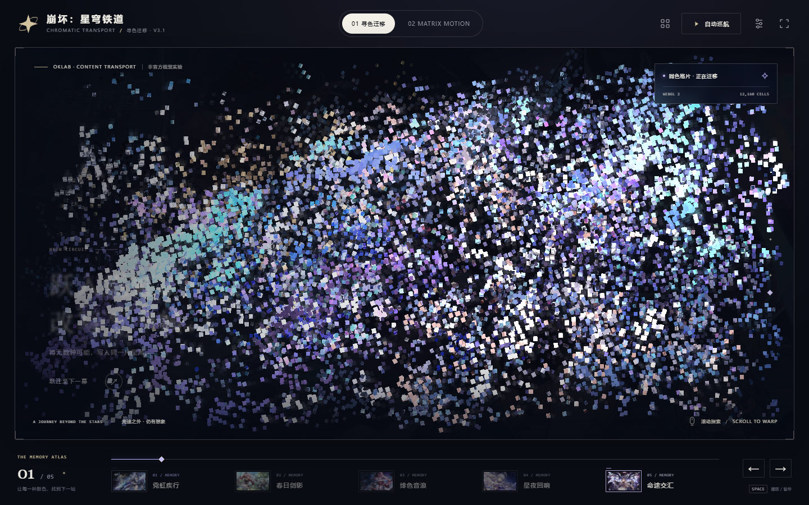

# Chromatic Tile Transport · 寻色迁移

**让图片的颜色决定格片去向，而不是给每张图套同一段转场。**

离线运行的、内容驱动的「完整图片 → 格片迁移 → 新图片」网页效果。默认示例是五张《崩坏：星穹铁道》插画组成的“跃迁影像档案”。不调用大模型，不上传图片，没有运行时 CDN、npm 包或后端。



[打开构建后的主示例](dist/index.html) · [双图最小示例](dist/two-images.html) · [新版动态预览](docs/preview.mp4) · [给智能体的使用说明](skill.md)

> 在 GitHub 中查看 HTML 通常会看到源码。把项目下载到本地，再用浏览器打开 `dist/index.html`。预览视频由真实网页按固定进度逐帧导出，不代表设备实时帧率。

## V3.1 修复了什么

V3 的问题不是每个位置都计算得慢，而是时间分配形成了两个视觉上的停顿。

旧版全局格阵在进度 13% 左右已完全打开；格片的出发时刻却大约分布在 10%–25%，还叠加了一条端点较“平”的五次缓动。末尾格片大约在 77%–85% 完成移动，但统一填缝要到 86% 才开始，于是出现「拆开—等一下—移动—等一下—填满」。具体出发时间取决于图片。

新版保留颜色映射、贝塞尔控制点和总时长，改为：

**边拆边启程 → 持续迁移 → 边落位边填缝。**

出发次序仍与格片颜色相关，但被压缩到总进度的 1.5%–5%；抵达时刻落在 95%–98.5%。每块格片使用自己的局部进度控制缝隙，在自己的最后 12% 旅程中逐步填满。速度曲线采用短余弦加减速段与中间恒定参数速度段，消除中间阶段的时间平台。

这不是所有格片同速直线运动：空间路径仍来自原来的颜色匹配，曲线长度、方向、弧度和格片间的先后不同。`src/timing.js` 同时提供 JavaScript 实现和从同一组参数生成的 GLSL，WebGL 与 Canvas 不再各维护一套时间常数。

默认完整转场仍为 **5.8 秒**，完整原图之间仍停留 **3.2 秒**。没有靠减少总时长掩盖问题。

## 立即运行

只看效果：直接用浏览器打开 `dist/index.html`，无需安装工具。

修改后重新构建，需要 **Python 3.10 或以上**；默认构建只用标准库：

```sh
python scripts/build.py
```

需要本地 HTTP 预览时：

```sh
python scripts/serve.py
```

然后访问终端显示的 localhost 地址。服务器只绑定本机，按 Ctrl+C 停止。不要把这个开发服务器当成公网部署方案。

操作：空格键播放/暂停，左右键切换，滚轮或拖动可前后控制转场，底部时间轴可精确停在中间，`F` 进入沉浸模式。寻色引擎面板可切换同位置/固定块旋对照、原色追踪、粒度、速度和距离权重。

## 原理：先配对，再沿真实路径搬运

每张图按照舞台的实际可见裁切区域采样。每个格片由 3×3 采样颜色平均，先在线性光空间中平均，再转换到 OKLab，附加位置和局部亮度变化特征。

匹配器先进行等量递归分组，在不超过 16 个格片的小组内求配对，再进行局部交换优化。代价同时考虑颜色差异、移动距离、局部亮度变化和相邻格片流向。它不是对整幅上万格片构建巨大稠密成本矩阵。

目标分配是一一对应的置换：每块源格片只对应一个目标位置，每个目标位置恰好使用一次。相近颜色的局部流向再用于计算贝塞尔控制点。格片携带原图纹理出发，沿这条路径移动，并在后段修正为目标纹理。

`matcher.js` 不依赖界面，可以在 Web Worker 和 Node 中运行；`transport.js` 负责采样、计算任务以及最多三种画面配置的内存缓存；`main.js` 负责 WebGL 2 实例化渲染、Canvas 2D 兼容路径和界面；`timing.js` 只负责可逆、确定性的时间进度。

**边界：**这是颜色对应，不是人物/物体理解。头发可能配到天空。不同色彩比例的两张图无法仅靠搬运保持所有格片颜色不变，最后必须修正色差。分组和局部交换是近似求解，不宣称全局最优。某组图片降低总目标函数，不等于所有单项指标都必然改善。

## 换自己的图片

最小示例：

```sh
python scripts/build.py --scenes examples/two-images/scenes.json --config examples/two-images/config.json --output dist/two-images.html
```

新建 `examples/my-gallery/scenes.json`，每个条目包含：

```json
{
  "slug": "frame-01",
  "name": "第一幕",
  "en": "FIRST MEMORY",
  "line1": "每一种颜色，",
  "line2": "都有下一站。",
  "caption": "这一幕的说明文字。",
  "tag": "A NEW JOURNEY",
  "accent": "#c4b9ed",
  "position": [0.5, 0.5],
  "src": "../../assets/my-gallery/01.webp"
}
```

整个文件是包含 2–24 个条目的 JSON 数组。`src` 相对于 **scenes.json 所在目录**，只能引用项目内文件；支持 PNG、JPEG、WebP，不接受远程 URL。宽高可省略，构建器读取真实图像头；填写了宽高但与素材不一致会明确报错。`position` 是裁切焦点 `[x,y]`，左上角为 `[0,0]`，右下角为 `[1,1]`。横图在手机竖屏上的焦点尤其重要。五幕示例与双图示例经过浏览器验证；更多场景需要自行检查缩略图密度和加载成本。

复制示例 `config.json`，修改品牌、标题、版权说明等，再执行：

```sh
python scripts/build.py --scenes examples/my-gallery/scenes.json --config examples/my-gallery/config.json --output dist/my-gallery.html
```

批量缩图和生成初始清单是可选功能，需要 Pillow：

```sh
python -m pip install -r requirements-dev.txt
python scripts/prepare_assets.py --input assets/my-originals --output assets/my-gallery --manifest examples/my-gallery/scenes.json --max-width 2048 --quality 86
```

输入目录的文件按文件名排序。此脚本不覆盖已有清单/同名输出。生成后仍需编辑标题、焦点、顺序；图片顺序会显著改变整体观感。

## 主要参数

`config.json` 的 `options` 作用于播放/匹配，`motion` 作用于时间设计。更改 `motion` 后必须重新构建。

| 参数 | 默认 | 调整含义 |
|---|---:|---|
| `options.density` | 152 | 横向格片上限；96 更粗，216 更细。实际值受舞台宽度限制。 |
| `options.duration` | 5.8 | 单次转场秒数，不包括完整原图停留。 |
| `options.holdTime` | 3.2 | 完整原图之间的主动停留，和已修复的内部停顿不同。 |
| `options.spatial` | 0.022 | 距离代价权重。0.002 更追随颜色；0.095 更偏向附近位置。 |
| `options.mapping` | `color` | `color` 为寻色；`geometry`、`position` 仅用于对照。 |
| `options.holdColor` | false | 前 86% 保留源图颜色，帮助查看搬运，不是日常默认风格。 |
| `options.trails` | true | 微光尾迹；关闭可减少 WebGL 绘制工作。 |
| `motion.launchBase / launchSpread` | 0.015 / 0.035 | 出发窗口起点和宽度，采用总转场的 0–1 进度。 |
| `motion.landBase / landSpread` | 0.95 / 0.035 | 抵达窗口起点和宽度，采用总转场进度。 |
| `motion.ramp` | 0.08 | 每块格片局部旅程的加/减速比例。增大会更柔和，但可能增加端部慢感。 |
| `motion.splitEnd` | 0.10 | 格片在局部旅程前 10% 中打开缝隙；此时已经在移动。 |
| `motion.fillStart` | 0.88 | 局部旅程 88% 开始填缝，而非等落位后再开始。 |

构建器和运行时会拒绝未知参数、非有限数字以及容易重建长空等区的时间范围。不要通过扩大出发延迟、提前结束移动或增加额外等待来制造“层次感”。

浏览器中的可复现接口：

```js
WarpArchive.pause();
WarpArchive.seek(0.17); // 第一幕到第二幕的 17%；1.17 表示第二幕到第三幕
WarpArchive.configure({ duration: 8, trails: false });
WarpArchive.getState();
WarpArchive.getMetrics();
WarpArchive.getPlan(0, 1); // 包含一对一 map、每格 10 浮点属性和指标
```

`seek()` 不会改动配对关系，逆向回到同一进度应得到相同画面。`getPlan()` 会把 TypedArray 转成普通数组，适合诊断，不要逐帧调用。自建 React/Vue 等页面时可把构建产物作为同源 iframe 使用，或复用 `src` 中的引擎模块；当前 `main.js` 仍和示例 DOM 绑定，并非已封装好的框架组件。

## 测试与验收

算法和构建测试需要 Python、Node.js 18+：

```sh
python scripts/check.py
```

完整浏览器测试需要开发依赖和 Chromium：

```sh
python -m pip install -r requirements-dev.txt
python -m playwright install chromium
python scripts/check.py --browser
```

测试会重新构建默认示例。浏览器优先使用 `CHROME_BIN` 指定的可执行文件，随后尝试系统 Chromium，最后使用 Playwright 安装的 Chromium。Linux 无 GPU 的测试模式采用软件渲染；这不是对真实设备帧率的承诺。

自己的清单使用通用验收脚本，不必满足固定五幕的基线哈希：

```sh
python scripts/inspect_demo.py --html dist/my-gallery.html --output reports/my-gallery
python scripts/inspect_demo.py --html dist/my-gallery.html --output reports/my-gallery-mobile --width 390 --height 844
```

验收输出包括每个场景的中途截图、两个衔接区截图、映射指标、往返像素一致性和网络请求检查。默认项目另外测试五组原 V3 颜色配对哈希完全不变，以及真实图片格片在原停顿区的时间速度不再为零。

还需人工以 4 / 5.8 / 8 秒连续播放，观察两端是否自然，而不只看中间漂亮截图。自动化测试能约束时间和像素变化，不能替你评价所有图片组合的美感。首次匹配、改变尺寸后重算、无 Worker 时的兼容计算仍可能显示加载提示；这与已修复的转场内部空等不同。

导出网页视频，需要系统安装 FFmpeg：

```sh
python scripts/render_preview.py --pairs 2 --fps 24 --output docs/preview.mp4
```

## 文件组织

```text
src/                 匹配器、采样/缓存、共享时间曲线、渲染器和界面模板
scripts/             构建、准备素材、预览、测试、验收、私密仓库发布
examples/starrail/   默认五幕配置与素材清单
examples/two-images/ 最小双图配置与素材清单
assets/starrail/     实际使用的五张 WebP
assets/originals/    用户提供的五张原始 PNG，未重采样
dist/               已构建、可离线打开的 HTML
tests/              算法、时间轴、构建、浏览器和发布安全测试
reports/            本轮实际测试记录
docs/               截图、预览视频、时间轴说明
README.md           人类读者入口
skill.md            智能体操作规程（规范源文件）
skills/.../SKILL.md  同内容的技能目录入口
```

## 创建私密 GitHub 仓库

**本交付尚未创建远程仓库或推送文件。** 当前会话的连接器能确认 GitHub 账号并操作已有仓库，但没有新建仓库动作；本机发布脚本用于补上这一步。

Windows / PowerShell，在项目根目录运行：

```powershell
pwsh -File .\scripts\publish-private.ps1
```

默认目标 `DDDFXYqiming/chromatic-tile-transport`，必须是该账号的本地 GitHub CLI 登录。需要 Python、Git 和 GitHub CLI；没登录时脚本调用 GitHub CLI 的网页登录，不要求在聊天或项目内填写令牌。

只检查文件、不作任何 Git 或 GitHub 更改：

```powershell
pwsh -File .\scripts\publish-private.ps1 -DryRun
```

脚本先建立本地提交，再以 `--private` 创建仓库；读取并验证远程确实私密后才推送，最后核对远程提交 SHA。它不会开启 Pages、切换成公开、强制推送、修改不相关的 origin，也不会修改全局 Git 作者或凭据配置。创建失败会停止，不会把错误误判成空仓库。

如果仓库创建成功但网络中断导致未推送，可明确使用 `-ResumeExisting` 重试；依然只接受指定账号下的私密仓库且不强推。脚本的发布安全测试使用模拟响应，不代表已经真实上传。成功执行后会在本地生成被 gitignore 排除的 `.publish-result.json`。

## 素材与来源

示例是非官方视觉实验，图片由用户提供，游戏和美术权利属于原权利人。项目未授予这些图片新的传播许可，不应因为代码可复用就把游戏素材当作通用商用素材。默认保持私密；替换成有权使用的素材后再讨论公开发布。项目未添加开源许可证。

颜色空间实现参考原作者的 [OKLab 说明](https://bottosson.github.io/posts/oklab/)。GitHub 发布选项参见 [gh repo create 官方文档](https://cli.github.com/manual/gh_repo_create)。这是独立实现，不是 andidea.jp 的源码复刻。
