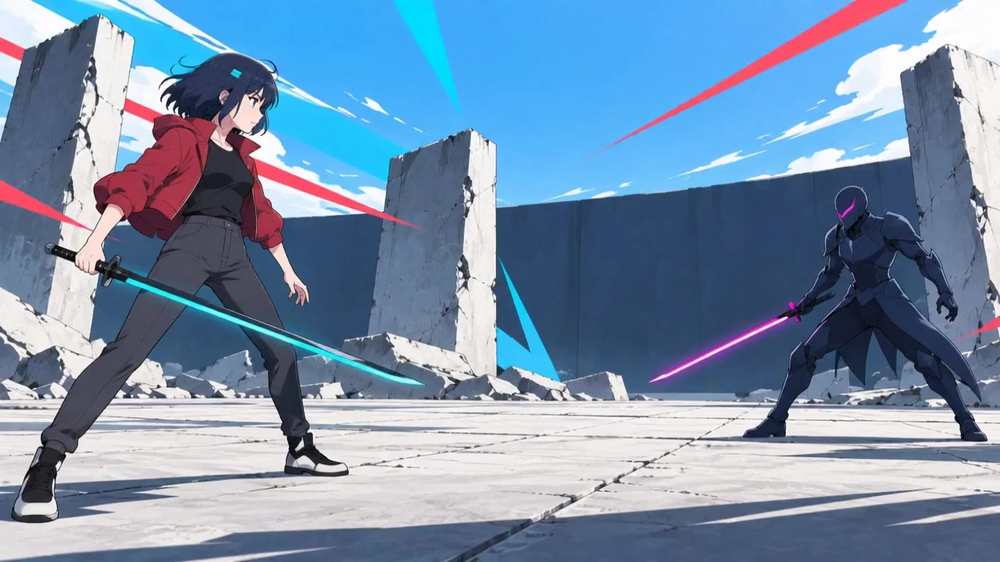

[简体中文](README.md) | English

# Chromatic Tile Transport

A small visual lab that runs in the browser.

The project started with one practical question. When two images meet in a transition, can each tile find a sensible place to go by looking at its colour? Later, a second experiment joined it. Matrix Motion uses layered artwork, local video and a fixed point grid to explore a different kind of movement.

There are two studies in the repository.

| Study | Entry | What it does |
| --- | --- | --- |
| Chromatic tile transport | [Effect 01](dist/index.html) | Matches tiles using colour, position and local brightness, then moves them along individual curves |
| Matrix Motion | [Effect 02](dist/matrix-battle.html) | Re-develops artwork, video, line work and a fixed grid on one shared timeline |

## Start with the pictures

This is an actual composite frame from the layered garden study. The character, fish, flowers and background are loaded separately and handed to the same Matrix display pipeline.


The cover belongs to the current AI-generated asset set. The battle-anime study has its own local videos as well. Click the frame below to open the 21.5-second exported preview.

[](reports/battle/matrix-battle-preview.mp4)

Matrix Motion keeps four versions together. The original layered garden, the two-shot garden video, the five-shot Aozora Drift study and the five-shot Crimson Edge study are all available from the image archive in the page header.

## Run it locally

This is a static project. Playback does not need a model, a backend or an account. The video files are already part of the project, so building and viewing the pages never reads a generation-service credential.

Use Python 3.10 or newer. From the repository root, run:

```powershell
python scripts/serve.py --directory . --port 8765
```

Open `http://127.0.0.1:8765/index.html`. Serving the repository root matters because the showcase page resolves `dist`, `src` and `assets` from there.

Press Space to play or pause, use the arrow keys to change scenes, and use the wheel or timeline to scrub in either direction. The Matrix Motion director panel switches between original colour, duotone, posterised colour, line work and the fixed grid. Video versions also have a switch for comparing the moving footage with its first frame.

## If you want to change it

Start with [docs/README.md](docs/README.md). It separates build notes, timing, layers, video input, PixiJS, verification and media rights instead of putting all of that on the front page.

The usual checks are:

```powershell
$env:PYTHONUTF8 = '1'
python scripts/check_matrix.py --browser
python scripts/check.py --browser
```

The two effects have separate source and timing paths. For Matrix Motion, the source lives under `src/matrix/` and pages are generated with `scripts/build_matrix.py`. The files under `dist/` are build output. Change the source, then rebuild.

## Where the project stands

The repository is reliable as a local visual experiment. The timeline, reverse scrubbing, grid bridges, video decoding, offline pages and mobile layouts have browser checks. The generated footage still shows its origin. Fast movement can redraw a face, hand or weapon, and a video model will sometimes take a different camera decision than the prompt suggested. Those limits are recorded in the matching documents instead of being covered with extra effects.

If you want to bring your own images or videos, read [Media and licensing](docs/MEDIA_LICENSE.md), [Reproduction](docs/REPRODUCTION.md) and the [Matrix documentation index](docs/README.md) first.

## License

The source code and scripts are released under the [MIT License](LICENSE). Images, videos, covers and report screenshots have their own provenance and usage boundaries. Open code does not grant new rights to every media file. Read [docs/MEDIA_LICENSE.md](docs/MEDIA_LICENSE.md) before replacing or redistributing the example media.

The visual studies were assembled by the user with generative tools. This project does not represent the original authors of any included media and does not provide a model service.
