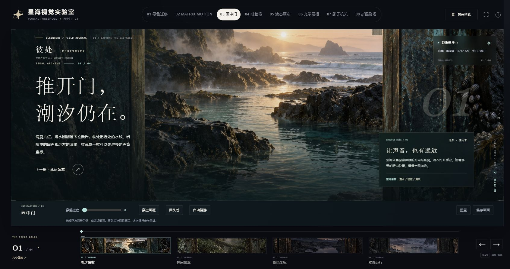
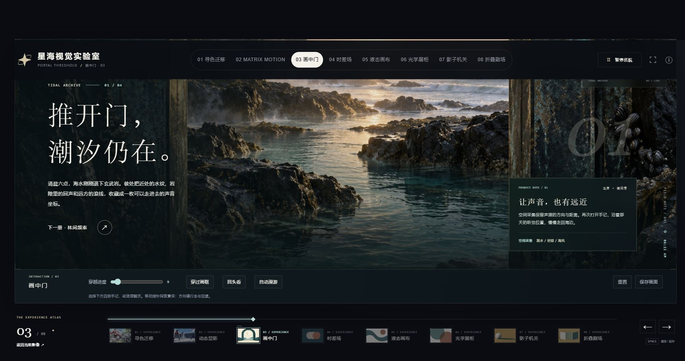
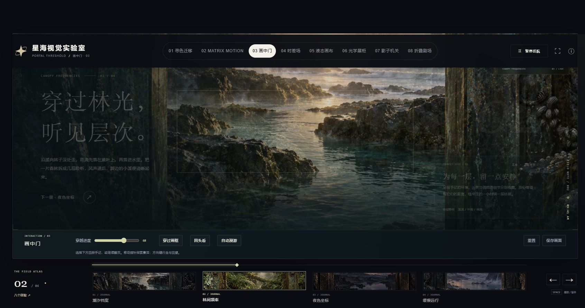
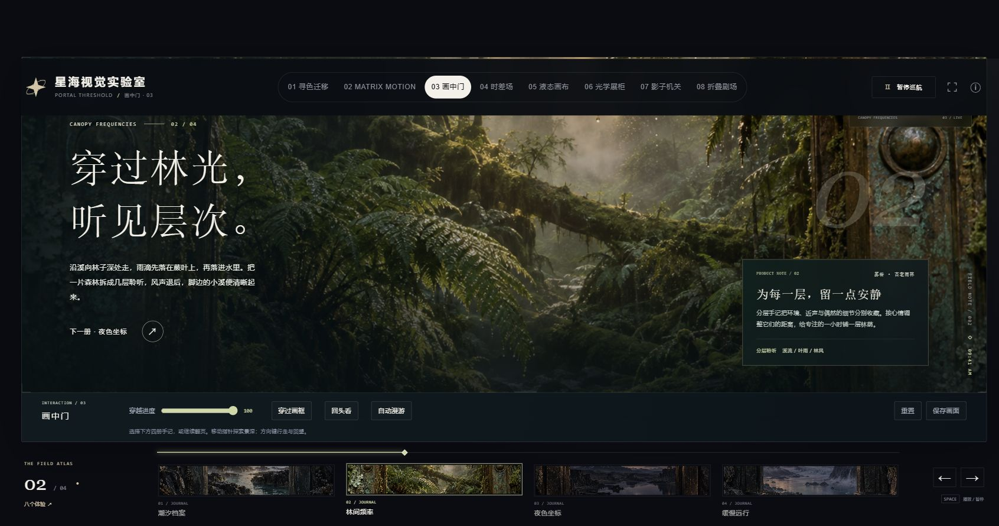
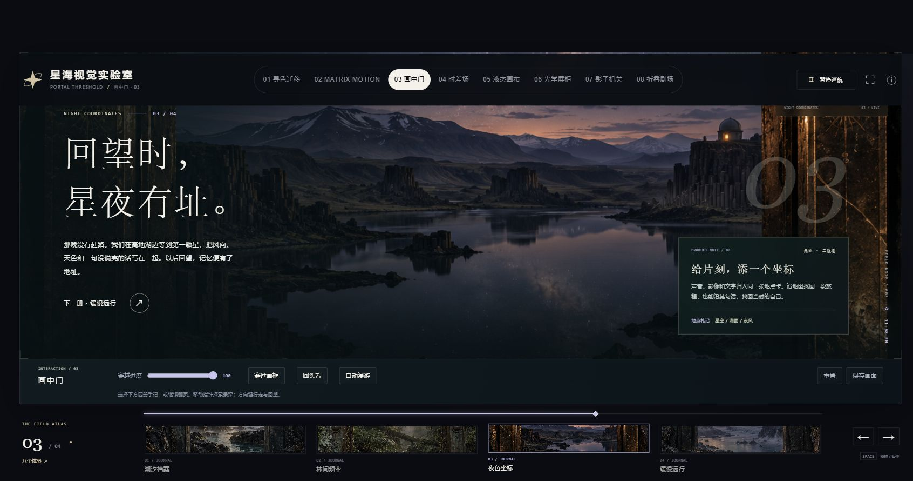
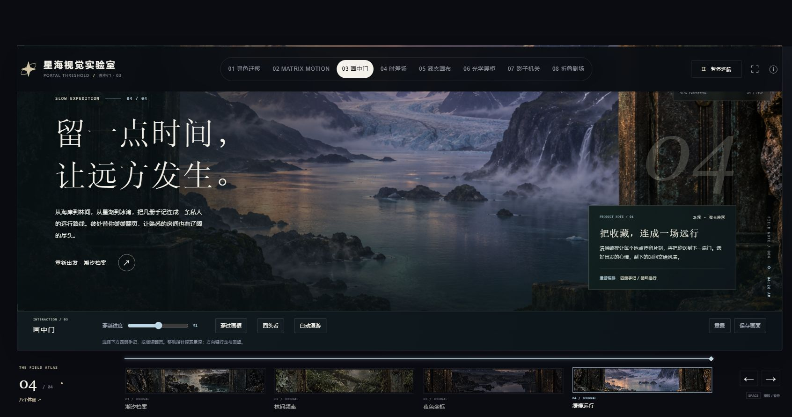

# 第 03 页「画中门」验收

**总评：不通过。**

桌面实测中，八项顶栏直列、四册手记的完整图文内容已经成立。但底栏仍能切换成跨体验导航；章节转场还出现了新文案配旧背景的短暂状态。

验收时间：2026-10-04 03:01–03:04（UTC+8）。

页面：`http://127.0.0.1:8765/dist/portal-threshold.html`。

分支：`feat/visual-lab-six-studies`。记录时 HEAD：`b1fe944ec1b76b02b30f1b34f5f079c54477d8de`。

浏览器：通过 `agent.browsers.get("chrome")` 取得的官方 Chrome 会话，返回类型为 `extension`。证据来自本轮实际点击、页面可见结构和截图。页面直接加载成功，使用的是现有本地服务。

## 1. 顶栏八个页面直接并排

**通过（本轮桌面窗口）。**

实拍中从 01 寻色迁移、02 MATRIX MOTION 到 08 折叠剧场，八个独立链接都在同一行完整显示。03 画中门是当前选中项，没有从第三项开始折叠为下拉菜单。页面结构也给出了各项独立链接目标。

## 2. 底栏是否只切换本页内容

**不通过。默认手记切换正常，但底栏还有跨体验模式。**

默认底栏显示潮汐档案、林间频率、夜色坐标、缓慢远行四册手记。实际点击手记和左右箭头时，地址始终是 `portal-threshold.html`；从第四册点击下一项回到第一册，从第一册点击上一项回到第四册。

但点击底栏左侧的“八个体验 ↗”后，底栏直接变成“THE EXPERIENCE ATLAS / 03 / 08”，四册手记被八个体验链接替换，左右箭头也变成“上一个体验”和“下一个体验”。页面结构中，这两个箭头的目标分别是 `matrix-battle.html` 和 `temporal-field.html`。

因此，底栏具有跨体验导航职责，不满足“底栏只切换本页内容”的要求。上述跨体验结论依据是实际展开后的界面与链接目标；按钮展开本身仍停留在第 03 页。

## 3. 图文是否一起换，是否有真正的介绍内容

**转场同步不通过；切换完成后的图文对应与内容存在性通过。**

四册手记切换完成后，背景、标题、正文、右侧产品札记、地点和时间都会变成对应内容：

| 手记 | 实际看到的画面 | 主标题 | 产品札记与介绍 |
| --- | --- | --- | --- |
| 潮汐档案 | 日出海岸、礁石、水纹和带附着物的门框 | 推开门，潮汐仍在。 | 让声音，也有远近；介绍空间采集保留方向和距离 |
| 林间频率 | 蕨叶、苔藓、倒木和林间光线 | 穿过林光，听见层次。 | 为每一层，留一点安静；介绍环境、近声和细节的分层聆听 |
| 夜色坐标 | 暮色山地、湖面倒影和远处亮灯建筑 | 回望时，星夜有址。 | 给片刻，添一个坐标；介绍声音、影像、文字归入地点卡 |
| 缓慢远行 | 峡湾、冰川、瀑布与雾气 | 留一点时间，让远方发生。 | 把收藏，连成一场远行；介绍地点停留和漫游编排 |

画面有清楚的岩石、水面、叶片、苔藓、门框材质等细节，正文和产品札记都是完整内容。当前页面并非只有无纹理的空展厅。这里确认的是介绍文案和图像的实际呈现，文案所述产品能力本身不在本轮功能证明范围内。

转场存在另一项问题：从潮汐档案点击林间频率后，截图已经显示“穿过林光，听见层次”和林间介绍，背景却仍是潮汐海岸；随后才变成森林。夜色与缓慢远行的转场也捕捉到了旧背景与新章节状态共存。文案在转场中变暗，有的帧接近不可读。不能将最终图文正确等同于整个切换过程同步。短暂错配的精确持续时间未测量。

## 4. 特效是在展示内容，还是页面在展示特效

**按第 03 页本轮实见，内容承载这一项通过，更接近“用特效展示内容”。**

页面有明确的“彼处 ELSEWHERE / 空间声音手记”主题，每册有独立场景、叙述、地点时间和产品介绍。转场与自动漫游围绕这些手记推进，主体已经是可以阅读的概念产品与旅行内容。

底部仍保留“互动导演台”、穿越进度、穿过画框、回头看和自动漫游等演示控件，因此仍带有实验展示的外观，但可见主体不只是一组特效参数。

与寻色迁移、Matrix 的相对优劣缺少本轮对照证据；这里的通过仅表示第 03 页实际具备内容主题、图文介绍和内容切换，不构成三页之间的实测排名。

## 实际操作与截图索引

| 步骤 | 操作与状态 | 结果 | 截图 |
| --- | --- | --- | --- |
| 1 | 打开第 03 页，查看初始潮汐档案和顶底栏 | 加载正常，八项顶栏直列 | [首屏](shots/01-tidal-initial.jpg)、[整页](shots/02-tidal-full-page.jpg) |
| 2 | 点击底栏林间频率，观察转场与完成状态 | 最终对应；转场有图文错配 | [转场](shots/03-forest-selected.jpg)、[完成](shots/04-forest-settled.jpg) |
| 3 | 点击底栏夜色坐标，观察转场与完成状态 | 最终对应；转场仍显示上一册背景 | [转场](shots/05-night-transition.jpg)、[完成](shots/06-night-settled.jpg) |
| 4 | 点击底栏缓慢远行，观察转场与完成状态 | 最终对应；进入自动漫游 | [转场](shots/07-journey-transition.jpg)、[完成](shots/08-journey-settled.jpg) |
| 5 | 第四册点下一项，再从第一册点上一项 | 正常在本页首尾循环 | [下一项回第一册](shots/09-next-wraps-to-tidal.jpg)、[上一项回第四册](shots/10-previous-wraps-to-journey.jpg) |
| 6 | 点击八个体验，观察底栏，再返回当前影像 | 底栏变成跨体验导航，不符合单一本页职责 | [跨体验模式](shots/11-footer-experience-mode.jpg) |
| 7 | 选择潮汐档案并滚回页首 | 回到首册内容 | [结束状态](shots/12-final-tidal-overview.jpg) |

截图均为本轮官方 Chrome 扩展直接生成的 JPEG，并已逐张打开查看。全页截图包含滚动范围；中途截图的固定顶栏位置受当前滚动位置影响。结论限定于本轮桌面窗口与上述操作。
