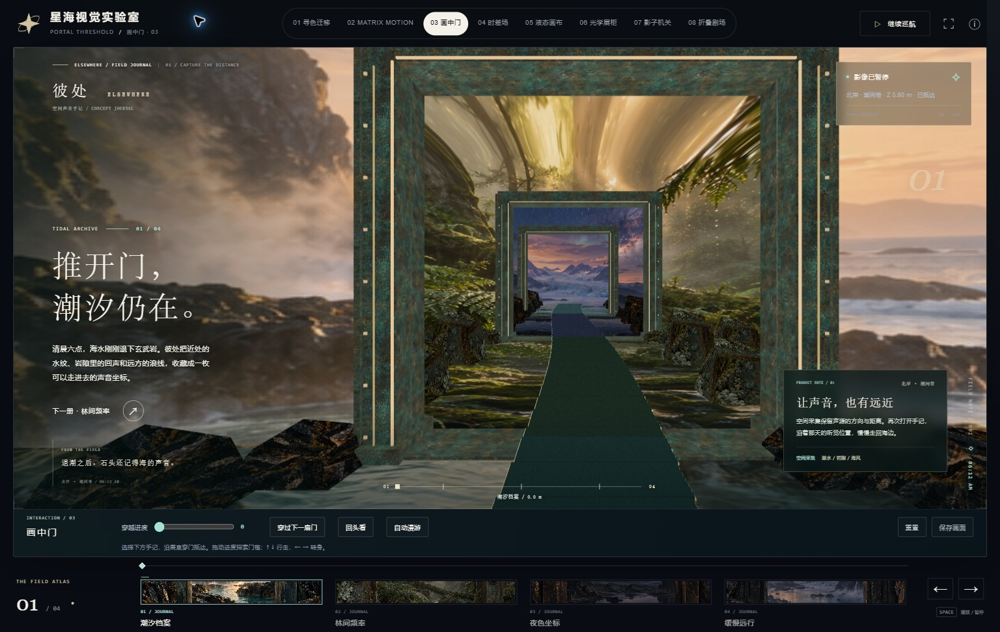
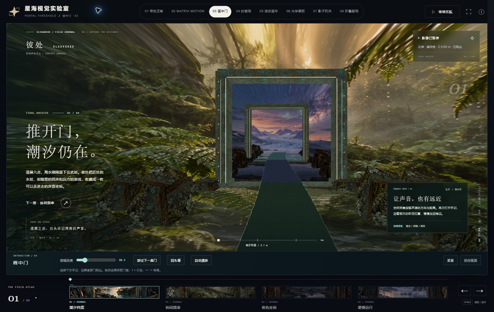
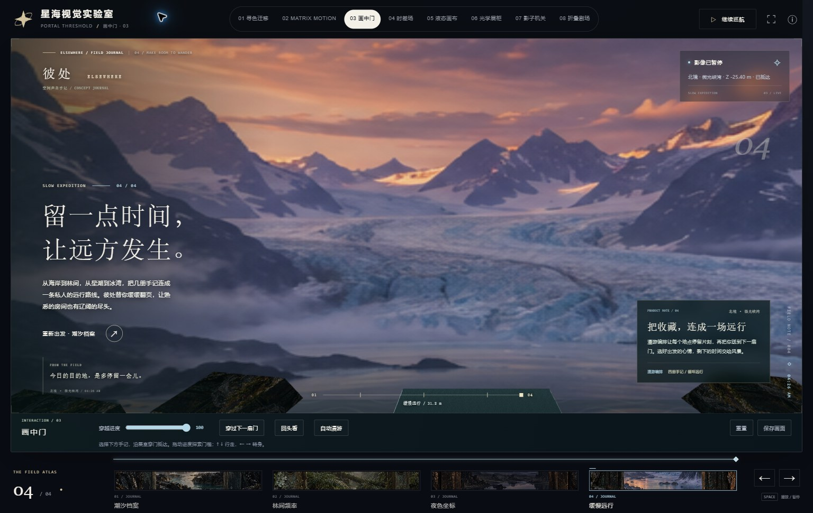
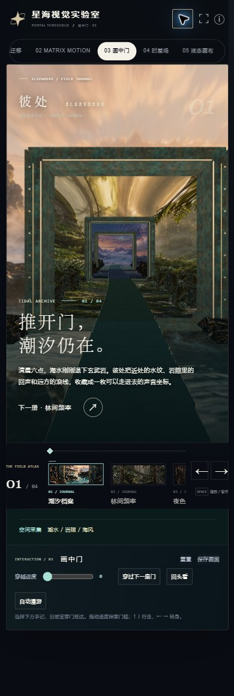

# 03 — ELSEWHERE spatial stage

The four generated chapter scenes surround a continuous 3D route. Scenic surfaces extend across the environment, water and rock outcrops; the generated copper material covers the modeled portal frames. A raised stone walkway connects three open doorways. The camera accelerates, crosses each threshold and turns before a return journey. Chapter copy follows the physical door planes.

At the verified 1536 × 960 desktop viewport, the live canvas occupies 71.9% of the viewport area. The mobile stage adapts to available height, with the journal note below it and the primary action above the chapter bar. All five original generated PNGs match their recorded SHA-256 hashes.

Validation completed on 2026-10-04:

- `python scripts/build_studies.py` and `python scripts/check_studies.py` passed, including portal resources and travel invariants at 20, 60 and 144 Hz.
- With `PYTHONUTF8=1`, `python scripts/check.py --browser` passed: 8 matcher checks, 11 timing checks, 41 Python tests and 33 browser checks.
- Live Chrome traversal reached the forest and fjord. The recorded return crossed all three doors and visited all four chapters in reverse, arriving at Z = 5.8 m in approximately 16.7 seconds.
- Pause preserved camera position and rendered pixels. Selecting another destination while paused preserved the current pose.
- At 390 × 844 and 320 × 740, the page had no horizontal overflow and the main action cleared the fixed chapter bar.
- Reduced-motion chapter selection arrived immediately with playback paused. The normal desktop view and pure-picture view were reviewed. The final browser console contained no warnings or errors.

The scenery uses image-based spatial surfaces. Door frames, the walkway and foreground outcrops are modeled geometry with depth-tested occlusion. The asset files remain the original generated images.

Evidence is stored in this directory. `checks.json` contains runtime and layout observations; `playback-forward.json` and `playback-return.json` contain live samples. `asset-integrity.json` records the asset hashes. The `legacy-*.json` and `legacy-build-tests.txt` files preserve the repository-wide check results.

